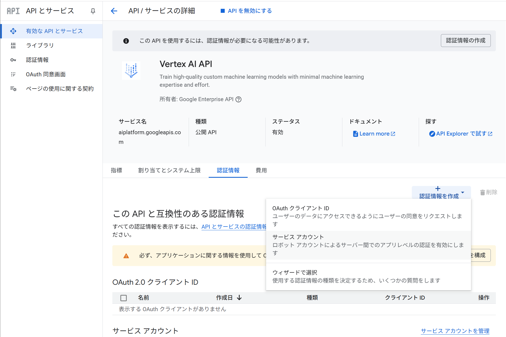
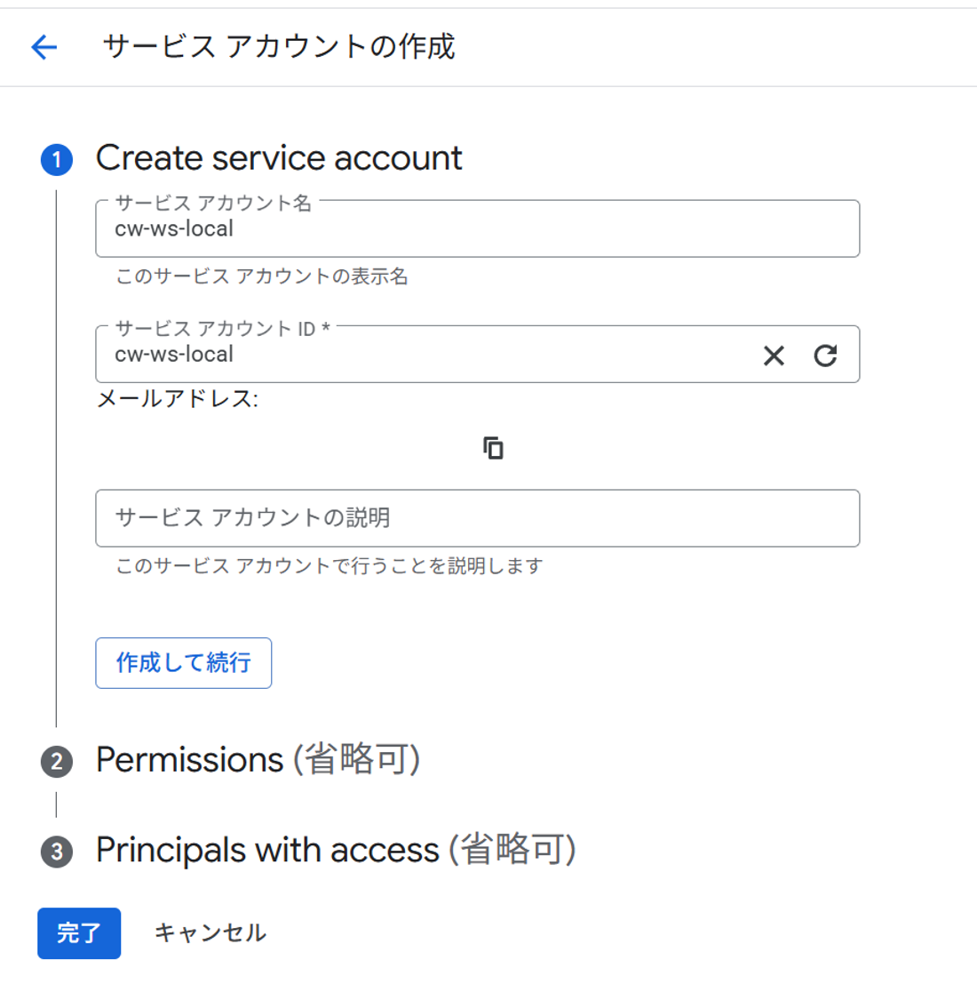
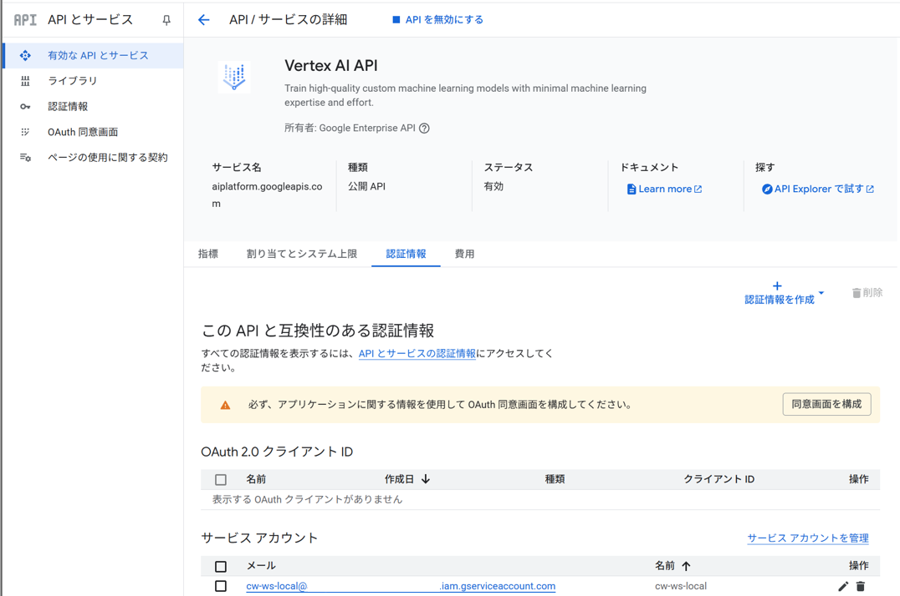
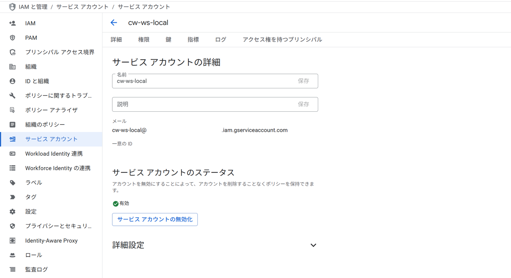
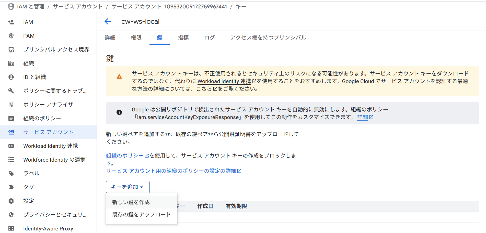
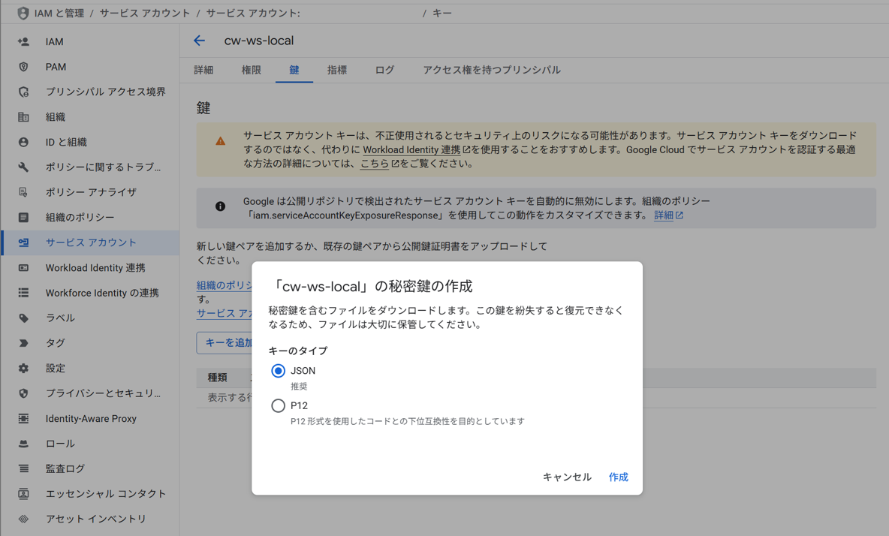

# Cloud Workstations Local構築

## 前提条件

- Dockerコンテナを動かす環境がある
- VSCodeが使える

## Cloud Workstations Localのソースコード取得

Vscodeのdevcontainerのソースコードを取得する  

以下のリポジトリをzipダウンロード  
[Shoma-progr-0210 > cw-ws-local](https://github.com/Shoma-progr-0210/cw-ws-local/tree/main)

## Vertex AIのAPIキー発行

認証情報を作成 > サービスアカウント  


### サービスアカウントの作成

Create service account

- サービス アカウント名: cw-ws-local
- サービス アカウントID: cw-ws-local



Permissions

- ロール: Vertex AI ユーザー

Principals with access

- 不要のため省略

→完了

### APIキー発行

https://cloud.google.com/vertex-ai/generative-ai/docs/start/api-keys?hl=ja

サービスアカウントの選択



鍵を開く



キーを追加→新しい鍵を作成



キーのタイプ`JSON`で作成



ダウンロードした鍵のファイルをこのリポジトリのディレクトリ直下に移動(`google_application_credential.json.sample`と同じ階層)

ファイル名を以下に変更  
`google_application_credential.json`

## Cloud Workstations LocalのDev Container起動

[Quick start: Open an existing folder in a container](https://code.visualstudio.com/docs/devcontainers/containers#_quick-start-open-an-existing-folder-in-a-container)

## 動作確認

(Dev Containerに接続した状態で) VSCodeのターミナルで以下を実行

```bash
cd /cw-ws-local
source /.venv/bin/activate
# git cloneは初回のみ
git clone https://github.com/google/adk-samples.git
cd adk-samples/python/agents/customer-service/
adk web
```

動作すればOK

## 参考

[Cloud Workstations Documentation - 事前構成済みのベースイメージ](https://cloud.google.com/workstations/docs/preconfigured-base-images?hl=ja)

[Visual Studio Code Docs - 開発コンテナを作成する](https://code.visualstudio.com/docs/devcontainers/create-dev-container)
